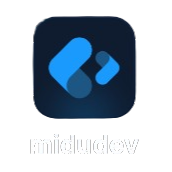

<!-- Imagen del banner al principio del perfil -->

<a href="https://github.com/KennethTorres">
  
</a>
<br>
<br>

<!-- Descripcion de mi en formato de codigo javascript -->

```javascript
const KennethTorres = {
  pronouns: "he/him",
  "Who am I?": "Developer who loves to build creative and innovative things. I mix technology + creativity."
  role: "Software Developer",
  code: [Javascript, Typescript, HTML, CSS, C#, Python, Java],
  tools: [React, Tailwind, Node, Express, Astro, NuxtJS],
  architecture: ["Client-server", "MVC", "N-Tier"],
  "What drives me?": [
     "Creating tools that make people's lives easier",
     "Troubleshooting"
  ]
}
```


  <!-- Gif happyCoder en la parte del "quien soy"  -->
  
  
  <div align="center"> 
    
  <!-- Seccion de "quien soy" -->
  **Who am I?**
  </div>
  
  I am a Business Informatics student with a passion for technology, problem solving, and developing digital solutions that make an impact. My journey into programming began when I entered university, where I discovered software development and logical thinking.
  
  Since then, I have been building a solid foundation in programming, focusing especially on Web Development. Although I explore both Front-End and Back-End, I find greater affinity with Back-End, where I enjoy working with logic, data structures, and the connection between systems to build robust and efficient applications.
   ㅤ
  </br>
  
  
  
  <!-- Gif de la segunda seccion de "un poco mas sobre mi" -->
  </br>
  
  <!-- Titulo de "un poco mas sobre mi" -->
   <h3 align="center">
    
    A Little More About Me 
    
   </h3>
   
  <!-- Seccion del contenido de "un poco mas sobre mi" -->
   I consider myself a curious, focused person who is always looking for challenges that push me out of my comfort zone. I enjoy working with server-side technologies and structuring solid, clean, and scalable solutions. I enjoy learning from those who have more experience than me, and I also love sharing what I know with those who are just starting out. I believe in the importance of logical thinking, collaboration, and simplicity as key principles in software development.


<br>
<br>
  <h3 align="center">
    <br>
    
     My Contacts
  </h3>
<br>


<div align="center">
  </a>
<a href="https://www.linkedin.com/in/kennethtorres" target="_blank">
  
</a>
<a href="https://mail.google.com/mail/?view=cm&to=kennethtorresbrizuela@gmail.com" target="_blank">
  
<a href="https://t.me/KennethTB" target="_blank">
  
</a>
</div>
  
<br>
<br>

  
<!-- github status-->
<!-- Titutlo -->
<h3 align="center">
  
     Github Status 

</h3>
<br>

<!-- Status -->
<div align="center">
  <a href="https://git.io/streak-stats"></a>
</div>
<br>
<br>
<!-- My Certificates-->
<div align="center">
  <h3>
     
    My Certificates
  </h3>
</div>
<br>
<div align="center">
<a href="https://certificados.midudev.com/21505caa-8af9-47fd-8bf7-06f80523f427.pdf" target="_blank">
  
</a>
<a href="https://c46e136a583f7e334124-ac22991740ab4ff17e21daf2ed577041.ssl.cf1.rackcdn.com/Certificate/ScrumFundamentalsCertified-KennethTorres-1075951.pdf" target="_blank">
  
</a>
  <a href="" target="_blank">
  
</a>
</div>
<br>
<br>
<!-- My Stacks -->
<!-- Titulo -->
<h3 align="center">
 
 My Stacks 
</h3>
<br/>

<div align="center">
    <br>
    <br>
    <br>
    <br>
</div>

<br/>
<br/>

<p align="center">
  
</p>
<!--
<div align="center">
  <h3>
     
     My Best Repositories
  </h3>
</div>
<br/>
<div align="center">
   <a href="https://github.com/KennethTorres/Landing-Page-Nuxt">
    
  </a>

  <a href="https://github.com/KennethTorres/Password-Generator">
    
  </a>
</div>


 ending-->


 
